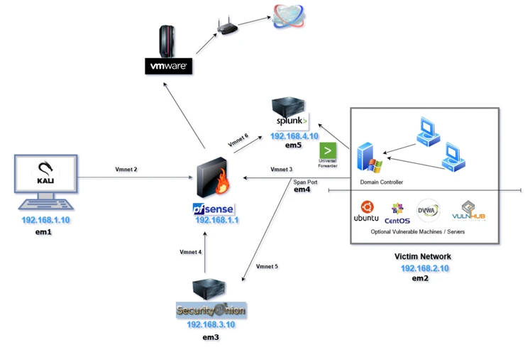
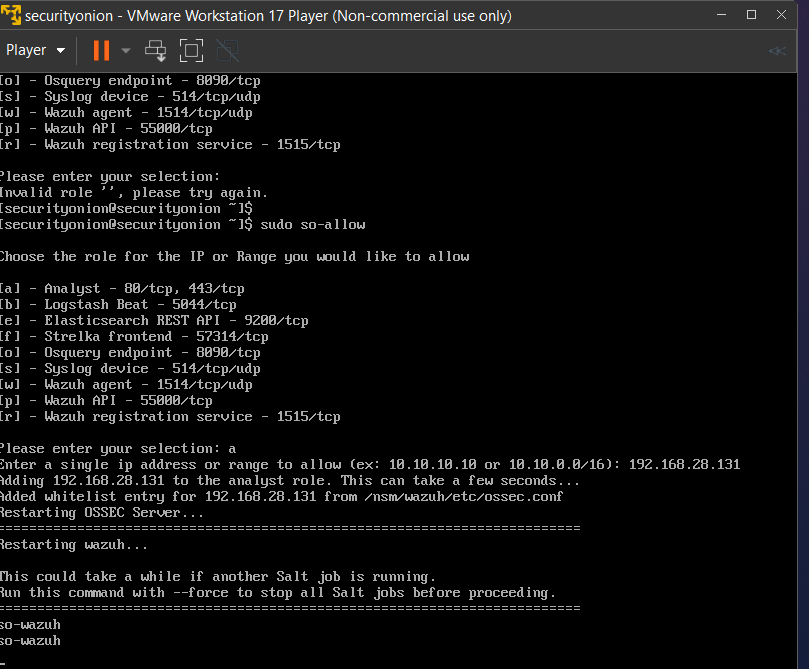
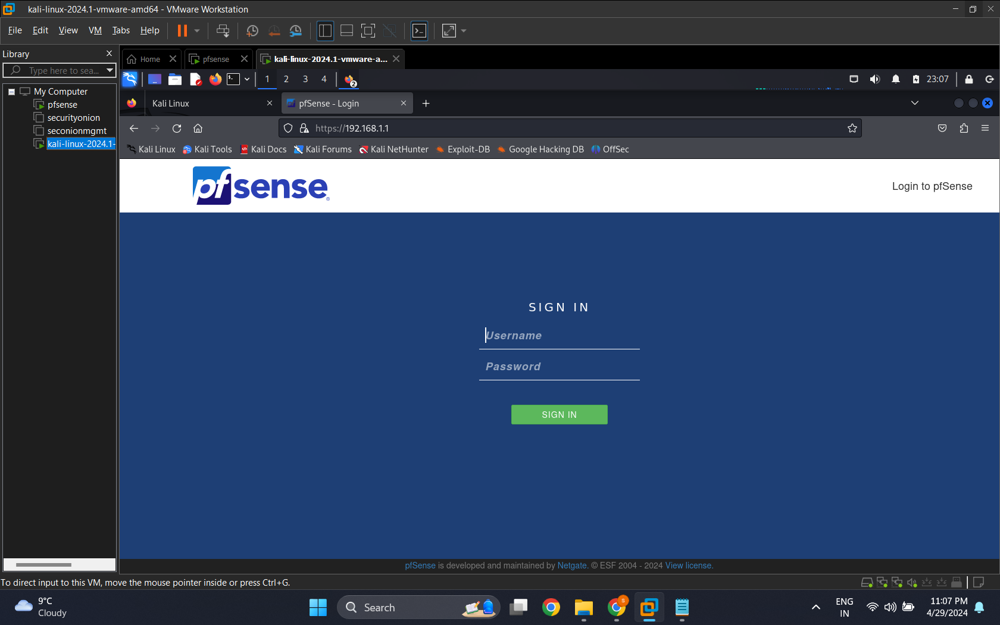
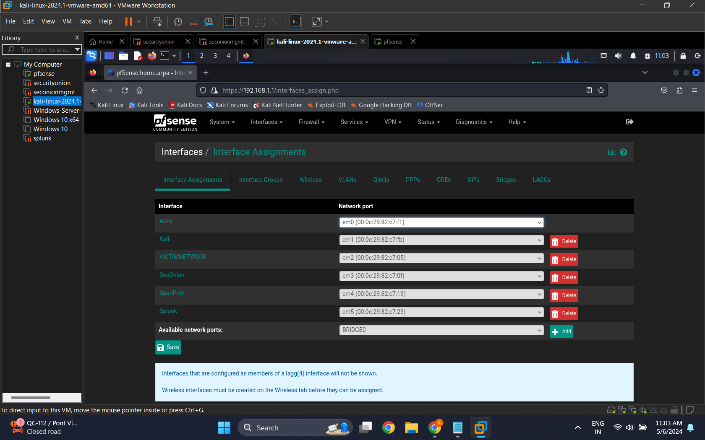
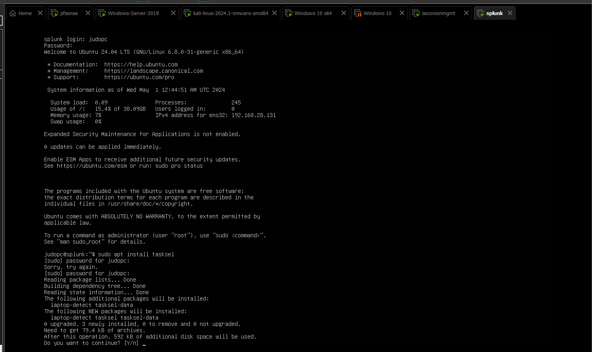
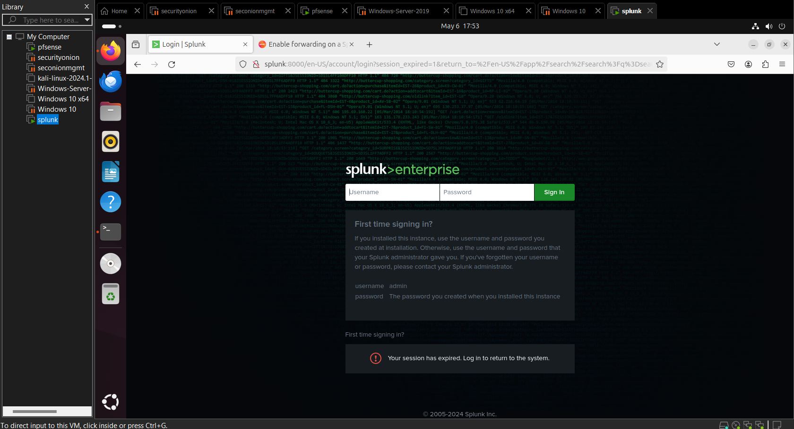
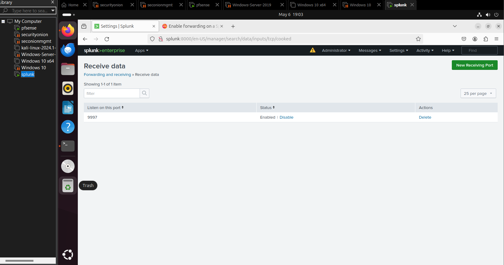
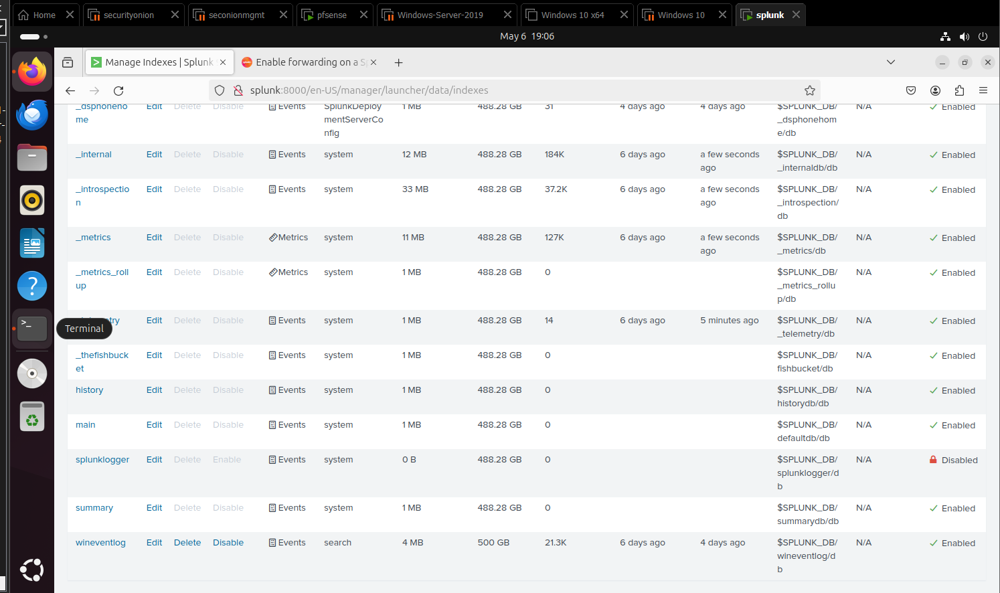

# Cybersecurity Homelab for Monitoring and Alerting

This project demonstrates the setup of a cybersecurity homelab focused on monitoring and detecting logs and alerts with a variety of tools and technologies.

`#Cybersecurity` `#Homelab` `#Monitoring` `#Splunk` `#VMware` `#KaliLinux` `#pfSense` `#SecurityOnion` `#WindowsServer2019` `#Windows10`

  
  
  
  

## Overview
A Homelab is a personal lab environment used to learn and experiment with different technologies in a controlled setting. This homelab is designed to explore monitoring and security practices using advanced configurations and custom setups.

## Tools Used
- **Attacker** - Kali Linux
- **Firewall** - pfSense
- **IDS** - Security Onion
- **SIEM** - Splunk
- **Hypervisor** - VMWare
- **Domain Controller** - Windows Active Directory
- **Vulnerable Machines** - Ubuntu, Windows

## Architecture
Here is a network diagram that illustrates the configuration and interaction between the different components within the homelab:

  

## Components
### Virtualization Platform
- **VMware Workstation 17 Pro:** Acts as the hypervisor hosting all other virtual machines.

### Network Security
- **pfSense Firewall:**
  - Serves as the firewall to segment the private homelab network.
- **Security Onion as IDS/Security:**
  - Used for intrusion detection and security monitoring.

### Penetration Testing
- **Kali Linux:**
  - Deployed as the attack machine for security testing.

### Network Management
- **Windows Server 2019 as a Domain Controller:**
  - Manages user authentication and domain management.
- **Windows 10 Desktops:**
  - Configured for typical workstation operations within the network.

### Monitoring
- **Splunk:**
  - Integrated to monitor and log the entire homelab environment.

## Configuration Steps

1. **Installation of VMware Workstation:**
   - Install VMware Workstation 17 Pro to serve as the platform for all virtual machines.

2. **Setup and Configuration of pfSense:**
   - Install pfSense on a VM to function as a dedicated firewall.
   - **Hardware Settings:** Add 5 additional network adapters to support connectivity for other machines administered by the pfSense machine.
   - **Network Configuration:** Assign custom virtual networks to the network adapters.

     
      
      *Initial Setup of Network Interfaces*

   - **Post-Installation Setup:**
     - After completing the default installation settings and reboot, configure the names and IP addresses for the 6 network interfaces. This setup includes the network segments that other virtual machines in the lab will participate in.

     
     
     *Configuration of Interfaces and IP Assignments*

   - **IP Addressing:**
     - The IP address `192.168.1.1` is set for accessing the pfSense WebGUI via the Kali Linux machine.
     - **Option 3 Interface:** Not assigned an IP address as it is designated to carry the span port traffic that Security Onion will monitor from the victim network.

3. **Deploying Security Onion:**
   - **Initial Setup:** Install Security Onion on a VM. It is configured to monitor all network traffic from the victim network by connecting directly to pfSense.
     - Configure two network adapters for Security Onion, assigning them to `Vmnet4` and `Vmnet5` respectively.
       - **Network Adapter 2:** Connected to `Vmnet4` (pfSense).
       - **Network Adapter 3:** Connected to `Vmnet5` as a span port.

     

   - **Network Configuration:**
     - `Network2` is mounted to `Vmnet4` which is managed by pfSense.
     - `Network3` (Vmnet5) is configured as a span port to monitor mirrored traffic.

     

   - **Post-Installation Configuration:**
     - After Security Onion reboots, log in with your specified username and password.

     

   - **Integrating with External Ubuntu Desktop:**
     - After installing Security Onion, configure an external Ubuntu Desktop (simulating a SOC/Security Analyst workstation) to access the Security Onion web interface.
       - Note the IP address of the Ubuntu machine (`secmgmt`).
       - Create a firewall rule on Security Onion to allow web access from the Ubuntu machine's IP address.

     - **Accessing the Web Interface:**
       - From the Ubuntu desktop, access the Security Onion web interface using the IP address captured in the previous step.

     

4. **Configuring Kali Linux:**
   - **Purpose:** Kali Linux is utilized as the attack machine to conduct various forms of offensive security testing against the Domain Controller and other attached machines.
   - **Installation:**
     - Download and install Kali Linux for VMware (64-bit version) to ensure compatibility and performance within the virtualized environment.
   - **Initial Setup:**
     - Once Kali Linux is operational, configure network settings to communicate within the homelab network. Initially, use the Kali machine to access the pfSense WebConfigurator for network management and security adjustments.
     - Open a web browser on Kali and navigate to `192.168.1.1` to access the pfSense interface.

      *Accessing pfSense from Kali Linux*

   - **Configuration Changes in pfSense:**
     - **Default Credentials:** Initially log in with the default credentials:
       - Username: `admin`
       - Password: `pfsense`
     - **DNS Settings:**
       - Modify the DNS settings by adding primary and secondary DNS servers to enhance network resolution capabilities.
     - **Interface Configurations:**
       - Configure all network interfaces within pfSense to ensure proper segmentation and security policies are in place.
       - Specific attention was given to configuring the interface for `opt3`.

      *Configuring Interfaces in pfSense*

   - **Conclusion:**
     - These configurations ensure that Kali Linux can effectively serve as an attack platform within the secure and isolated environment of the homelab, while maintaining controlled access to network resources and services.

5. **Setting up Windows Server 2019:**
   - **Domain Setup:**
     - Installed Windows Server 2019 and configured it as the Domain Controller within an Active Directory domain that includes 2 Windows 10 machines.
   - **Network Configuration:**
     - During the installation, the Network Adapter was set to `Vmnet3` to ensure proper network segmentation and communication within the homelab environment.
   - **System Naming:**
     - After installation, the server's hostname was changed to `cyberpc` to reflect its role and identity within the network.
   - **Active Directory Configuration:**
     - Installed and configured Active Directory Domain Services and Active Directory Certificate Services to manage authentication and digital certificates within the domain.
   - **User Management:**
     - Added domain users and gave specific configurations to the accounts. For instance, created a user with the username `firstuser10`.
   - **Security Settings:**
     - Disabled the Windows Defender Firewall for all networks to facilitate certain test scenarios and inter-VM communication without hindrance.

     1.png) *Firewall Settings*

   - **Network Gateway Configuration:**
     - Configured pfSense as the default gateway for the domain controller to manage all incoming and outgoing network traffic effectively.

     2.png) *Setting pfSense as Default Gateway*

   - **Conclusion:**
     - These steps ensure that Windows Server 2019 is effectively set up as a secure and functional Domain Controller within the homelab, handling domain management, user authentication, and network traffic control.

6. **Configuring Windows 10 Desktops:**
   - Setup multiple Windows 10 VMs to simulate user interaction within the network.

7. **Integrating Splunk for Monitoring:**
   - **Installation Overview:**
     - Splunk was installed on an Ubuntu Server. This involved changing the network adapter setting to `Vmnet6` to ensure proper network traffic management and isolation within the homelab.

   - **Initial Login and Configuration:**
     - After the installation of Splunk, I successfully logged into the Splunk interface.

      *Initial Login to Splunk*

   - **GUI Installation on Ubuntu Server:**
     - To manage Splunk more effectively and provide a graphical interface, I installed a GUI on the Ubuntu Server. This was achieved using the `tasksel` command to install the Ubuntu Desktop environment.
     - Once the desktop environment was installed, Splunk could be accessed through a web browser by navigating to `http://splunk:8000`.

      *Accessing Splunk via GUI on Ubuntu Desktop*

   - **Conclusion:**
     - This setup enables comprehensive monitoring and analysis capabilities within the homelab environment, allowing real-time data collection and visualization through   Splunk. The GUI enhances ease of use and accessibility for ongoing system management and monitoring.

## Advanced Splunk Configuration and Alert Integration

After completing the basic setup of Splunk in Step 7, the following configurations were implemented to enhance monitoring and alerting capabilities within the homelab environment.

- **pfSense Firewall Rules:**
  - Configured pfSense to allow outbound access from the Domain Controller to facilitate network communications necessary for monitoring and logging.
  
   *pfSense Firewall Rules Setup*

- **Starting and Signing Into Splunk:**
  - Started the Splunk instance and signed in to configure advanced settings.

- **Setting Up Log Receiving:**
  - Configured "Receiving" on the Splunk server to enable the system to accept logs. This involved adjusting settings for forwarding and receiving, including setting a specific port for Splunk to listen to inbound connections from the universal forwarder.
  
   *Splunk Listening Configuration*

- **Creating a Dedicated Splunk Index:**
  - Created an index named "wineventlog" specifically for storing and managing Windows event logs.
  
   *Splunk Index for Windows Event Logs*

- **Installing and Configuring Splunk Universal Forwarder on Domain Controller:**
  - Installed the Splunk Universal Forwarder on the Windows Server (Domain Controller) to forward logs to the Splunk server. During installation, the IP address of the Splunk server and the default ports (8089 & 9997) were configured to ensure proper log forwarding.

- **Integrating Alerts from Security Onion:**
  - Configured Security Onion to forward alerts to Splunk, thereby integrating alert management into the overall monitoring strategy.
  
   *Alert Configuration in Security Onion*

## Conclusion
This project has successfully demonstrated the setup and integration of an intricate homelab environment tailored for advanced security testing and network management. By meticulously configuring and deploying a range of security tools—including pfSense, Splunk, Security Onion, and Kali Linux—this homelab serves not only as a robust platform for security exploration but also as a practical, hands-on learning environment. The detailed configurations and the challenges overcome during the project have provided valuable insights into the dynamic field of cybersecurity. This environment facilitates ongoing learning and experimentation, essential for staying abreast of emerging threats and honing the skills required to mitigate them. Through this project, we have created a powerful tool for understanding complex security systems and developing effective security solutions, thereby contributing to a deeper and more practical understanding of cybersecurity principles and practices.
