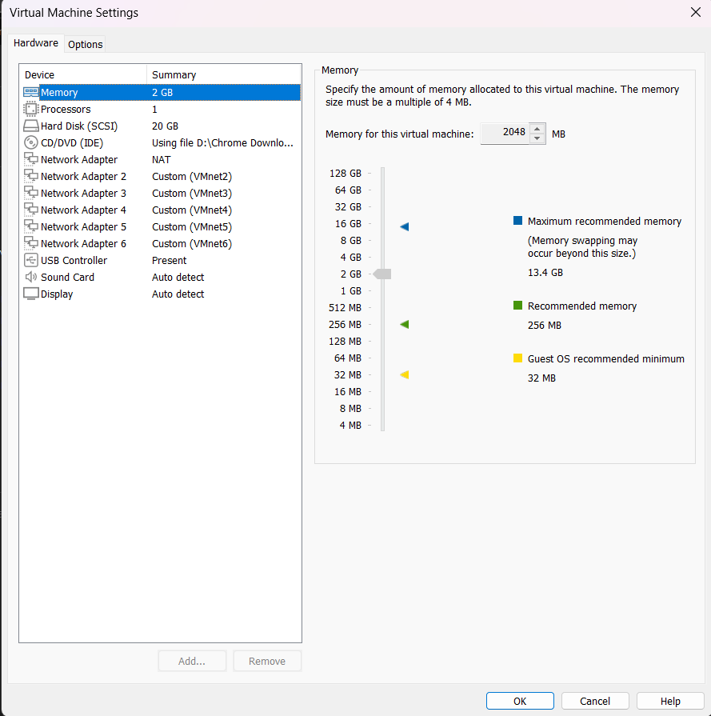
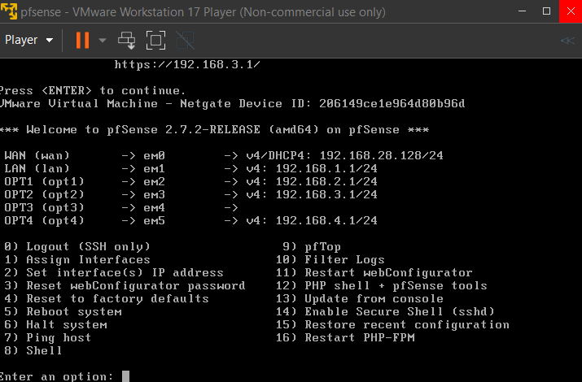
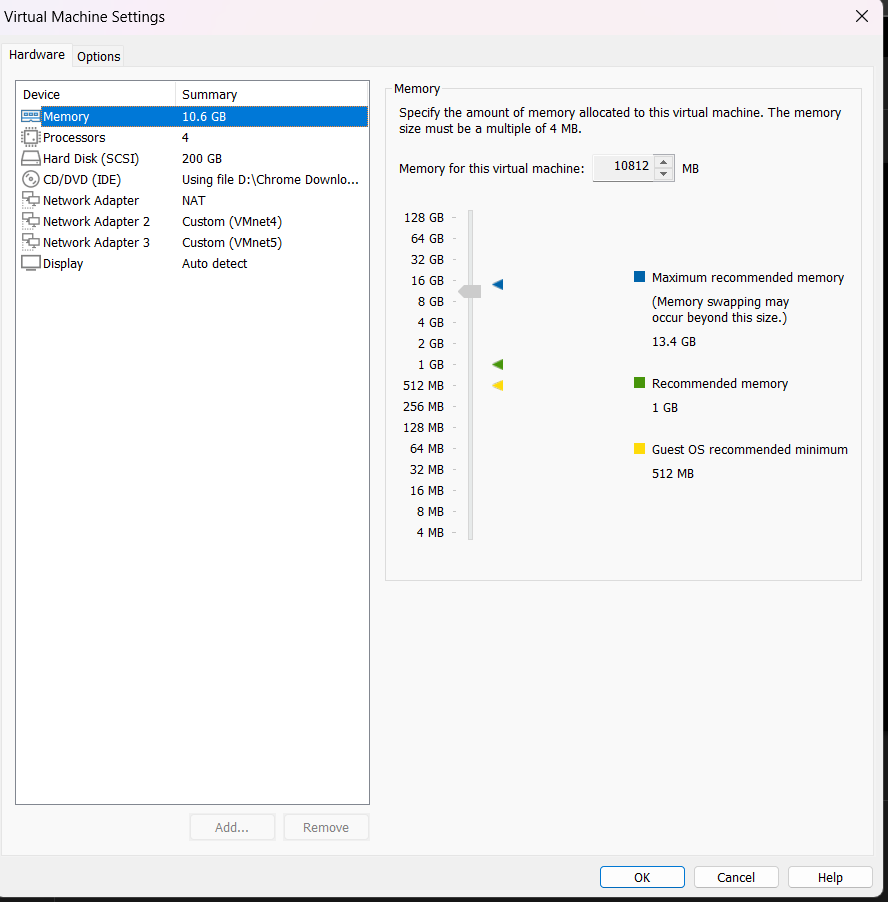
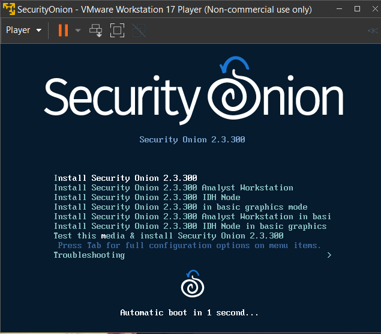
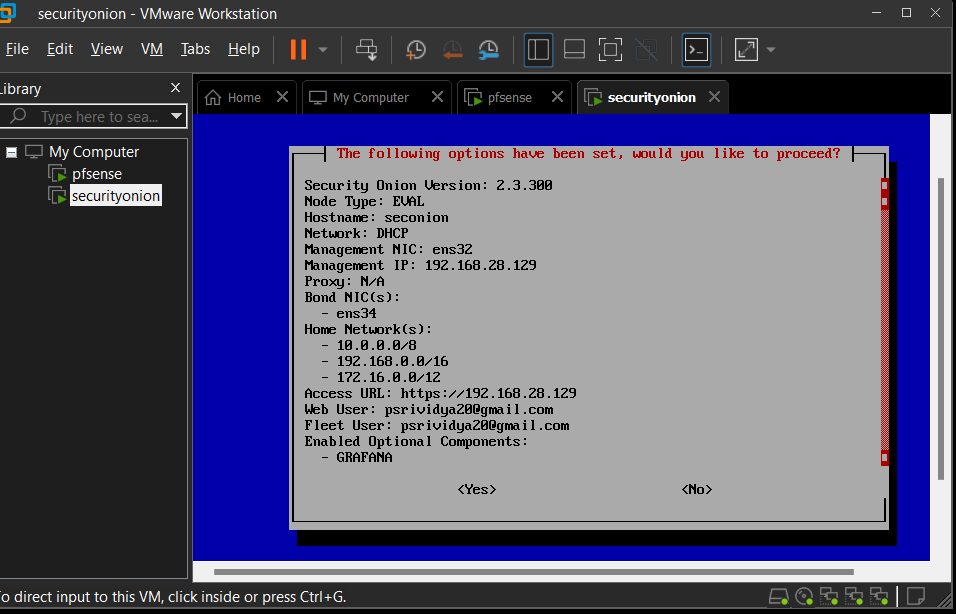

# Cybersecurity Homelab for Monitoring and Alerting

This project demonstrates the setup of a cybersecurity homelab focused on monitoring and detecting logs and alerts with a variety of tools and technologies.

`#Cybersecurity` `#Homelab` `#Monitoring` `#Splunk` `#VMware` `#KaliLinux` `#pfSense` `#SecurityOnion` `#WindowsServer2019` `#Windows10`

  
  
  
  

## Overview
A Homelab is a personal lab environment used to learn and experiment with different technologies in a controlled setting. This homelab is designed to explore monitoring and security practices using advanced configurations and custom setups.

## Tools Used
- **Attacker** - Kali Linux
- **Firewall** - pfSense
- **IDS** - Security Onion
- **SIEM** - Splunk
- **Hypervisor** - VMWare
- **Domain Controller** - Windows Active Directory
- **Vulnerable Machines** - Ubuntu, Windows

## Architecture
Here is a network diagram that illustrates the configuration and interaction between the different components within the homelab:

## Components
### Virtualization Platform
- **VMware Workstation 17 Pro:** Acts as the hypervisor hosting all other virtual machines.

### Network Security
- **pfSense Firewall:**
  - Serves as the firewall to segment the private homelab network.
- **Security Onion as IDS/Security:**
  - Used for intrusion detection and security monitoring.

### Penetration Testing
- **Kali Linux:**
  - Deployed as the attack machine for security testing.

### Network Management
- **Windows Server 2019 as a Domain Controller:**
  - Manages user authentication and domain management.
- **Windows 10 Desktops:**
  - Configured for typical workstation operations within the network.

### Monitoring
- **Splunk:**
  - Integrated to monitor and log the entire homelab environment.

## Configuration Steps

1. **Installation of VMware Workstation:**
   - Install VMware Workstation 17 Pro to serve as the platform for all virtual machines.

2. **Setup and Configuration of pfSense:**
   - Install pfSense on a VM to function as a dedicated firewall.
   - **Hardware Settings:** Add 5 additional network adapters to support connectivity for other machines administered by the pfSense machine.
   - **Network Configuration:** Assign custom virtual networks to the network adapters.

     
      
      *Initial Setup of Network Interfaces*

   - **Post-Installation Setup:**
     - After completing the default installation settings and reboot, configure the names and IP addresses for the 6 network interfaces. This setup includes the network segments that other virtual machines in the lab will participate in.

     
     
     *Configuration of Interfaces and IP Assignments*

   - **IP Addressing:**
     - The IP address `192.168.1.1` is set for accessing the pfSense WebGUI via the Kali Linux machine.
     - **Option 3 Interface:** Not assigned an IP address as it is designated to carry the span port traffic that Security Onion will monitor from the victim network.

3. **Deploying Security Onion:**
   - **Initial Setup:** Install Security Onion on a VM. It is configured to monitor all network traffic from the victim network by connecting directly to pfSense.
     - Configure two network adapters for Security Onion, assigning them to `Vmnet4` and `Vmnet5` respectively.
       - **Network Adapter 2:** Connected to `Vmnet4` (pfSense).
       - **Network Adapter 3:** Connected to `Vmnet5` as a span port.

     

   - **Network Configuration:**
     - `Network2` is mounted to `Vmnet4` which is managed by pfSense.
     - `Network3` (Vmnet5) is configured as a span port to monitor mirrored traffic.

     

   - **Post-Installation Configuration:**
     - After Security Onion reboots, log in with your specified username and password.

     

   - **Integrating with External Ubuntu Desktop:**
     - After installing Security Onion, configure an external Ubuntu Desktop (simulating a SOC/Security Analyst workstation) to access the Security Onion web interface.
       - Note the IP address of the Ubuntu machine (`secmgmt`).
       - Create a firewall rule on Security Onion to allow web access from the Ubuntu machine's IP address.

     - **Accessing the Web Interface:**
       - From the Ubuntu desktop, access the Security Onion web interface using the IP address captured in the previous step.

     

4. **Configuring Kali Linux:**
   - Setup Kali Linux for conducting security tests and penetration testing.

5. **Setting up Windows Server 2019:**
   - Install and configure Windows Server 2019 as a Domain Controller.

6. **Configuring Windows 10 Desktops:**
   - Setup multiple Windows 10 VMs to simulate user interaction within the network.

7. **Integrating Splunk for Monitoring:**
   - Install Splunk to aggregate and analyze logs from various sources within the homelab.

## Conclusion
This project demonstrates the setup and integration of a complex homelab designed for security testing and network management. It provides a practical learning environment for exploring the capabilities of various security tools and techniques.
